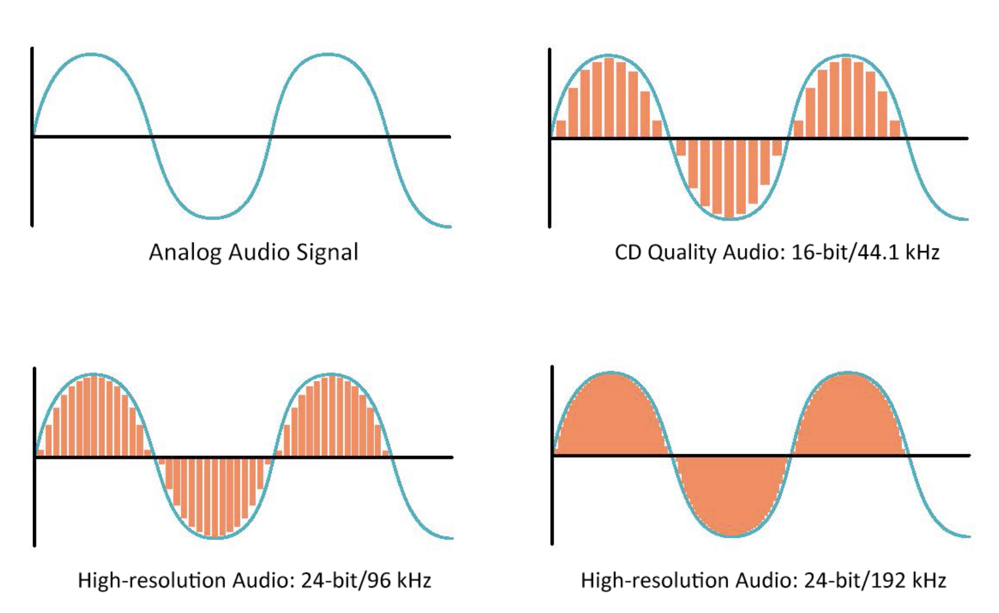

# Audio Super-Resolution using Deep Learning

Website: 

### Goal

The goal of this project is to upsample low-quality audio into higher-quality audio in real time. 

### Background information

##### Sample Rate and Bit Depth

There are many factors that determine how good audio sounds to human ears. Two of the most important are sample rate and bit depth. Sample rate is how frequently a sound wave is measured (in videos, this is called the frame rate). Bit depth is how precisely a wave is measured. In the image below, sample rate is represented by the width of the rectangles, and bit depth is represented by the height. Using rectangles that more completely fill the area under the sound wave results in higher quality audio. 

In CD quality audio, the sample rate is 44.1kHz, and the bit depth is 16. Audio files are considered "high-quality" at a sample rate of 48kHz, and a bit depth of 16 or 24. 

##### Other considerations

Of course, there are other flaws that can reduce audio quality. There can be background noise such as other people talking or music in the background, echo, or random noise introduced by the transmission method. These things can be more difficult to quanitatively measure. 

### Method

Using high-quality audio data taken from OpenSLR.org, the plan is to down-sample the audio, add other flaws such as background noise, then use a GAN to restore the original, high-quality version. 

This is an ongoing team project, so I am not able to share code or results at this time. 
