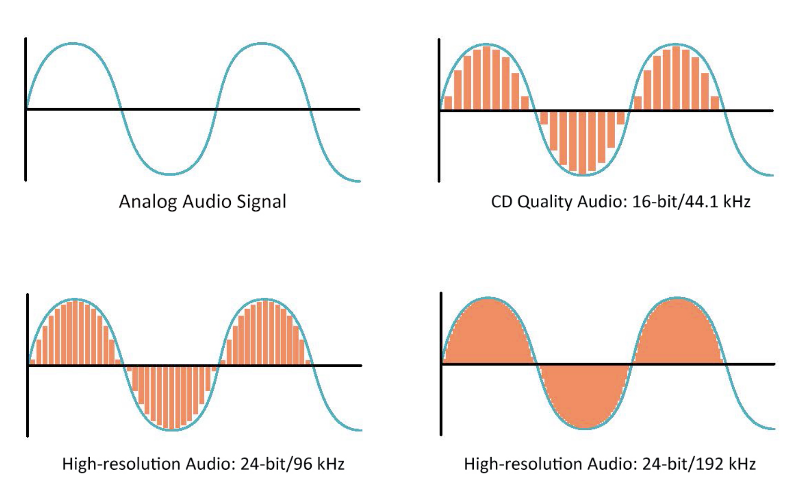
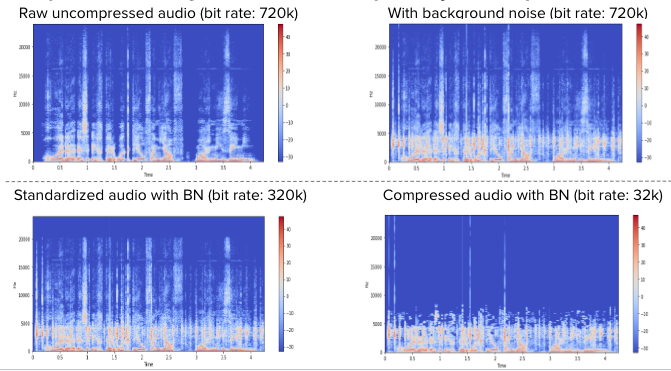
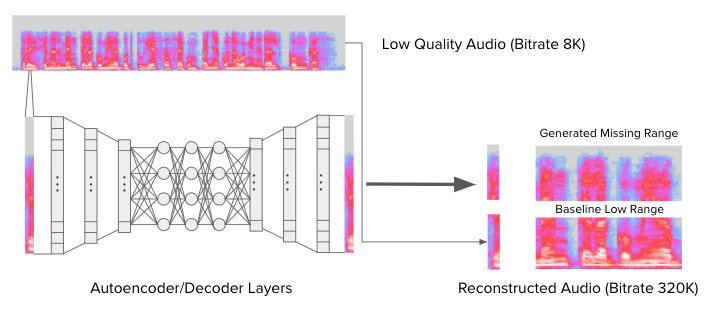
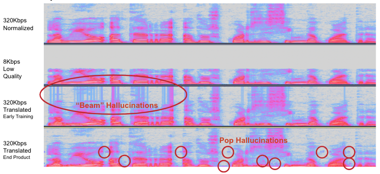
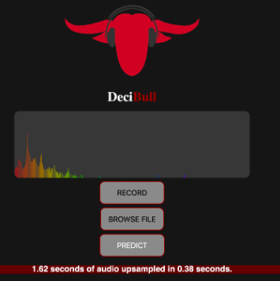

# Audio Super-Resolution using Deep Learning

### Goal

The goal of this project is to upsample low-quality audio into higher-quality audio in real time. 

  Audio telecommunication is one of the oldest forms of remote communication. Yet, despite new forms of digital mediums such as visual (video conference, text messages) or tactile (wearable alerts) formats, we still rely heavily on communicating through audio as a primary means of conveying mission critical data such as in airliners, submarines and even in space. For radio waves to travel long distances, they need to be in the lower frequency range (around < 1 - 100 MHz, compared to 4G LTE at 1800+ MHz). This comes at the expense of quality where low frequency transmitted audio has the distinct “walkie talkie” characteristic. 
  
  This project aims to solve this problem by enhancing poor quality audio by upscaling and predicting high frequency bandwidth data using lower frequency data present in common low bandwidth audio. Similar to how images are upscaled using machine learning, by observing audio patterns of human voice, we can fill in the gaps that would otherwise be discarded by audio compression and produce high quality audio at the receiving (client) end. The data used for training will be high quality audio (target) which is subsampled to create low quality audio for training. The end product should be able to produce high quality samples from low quality audio input. 

### Background information

##### Sample Rate and Bit Depth

There are many factors that determine how good audio sounds to human ears. Two of the most important are sample rate and bit depth. Sample rate is how frequently a sound wave is measured (in videos, this is called the frame rate). Bit depth is how precisely a wave is measured. In the image below, sample rate is represented by the width of the rectangles, and bit depth is represented by the height. Using rectangles that more completely fill the area under the sound wave results in higher quality audio. 

In CD quality audio, the sample rate is 44.1kHz, and the bit depth is 16. Audio files are considered "high-quality" at a sample rate of 48kHz, and a bit depth of 16 or 24. 

##### Other considerations

Of course, there are other flaws that can reduce audio quality. There can be background noise such as other people talking or music in the background, echo, or random noise introduced by the transmission method. These things can be more difficult to quanitatively measure. 

#### Method

Using high-quality audio data taken from OpenSLR.org, the plan is to down-sample the audio, add other flaws such as background noise, then use a GAN to restore the original, high-quality version. 

#### Dataset:
* From Open Speech and Language Resources (OpenSLR)
* Size: 84.94GB
* Total Audio Files: 99,617 Files
* ~130 hours worth of high quality recordings (in WAV)
* Combination of 35 languages or dialects, by male and female speakers
* Given all datasets have sampling rates of 48,000 Hz, we estimate available total dataset to be 8,343,408,000 rows of 1-d arrays (input for training/test)

Before pushing our data for training, we had to standardize our high quality audio, then we compressed it to low quality audio. We also added background noise to our audio files to simulate real audio. The 4 spectrograms above show how different audio files look in the frequency time domain. The top left graph is the uncompressed audio at 720k bit rate, the one on the right is with background noise added. The two charts below show the standardised and compressed versions and you can clearly see that there is a lot of frequency data that’s removed when the audio is compressed to 32k.

### The Model

Our team discussed and tried several options for model architecture, with three options broken down below:

|Model       | Training data |   Target         |      Issues      |
| -----------| ----------- |-----------|-----------|
| DNN        | Fourier transformed frequency amplitude for chunks of low quality audio |Predict all frequencies of the high quality audio signal|Hard to predict full audio. Reverse FT does not work if when error is too high to calculate waveform. |
| WaveGAN    | Raw low quality audio waveform |Predict the difference between the two raw waveforms (low quality vs high quality)|Direct waveform prediction produces extreme audio artifacts. Low performance.|
| Spectrogram Autoencoder| Fourier transformed frequency amplitude for chunks of low quality audio|Predict the missing frequencies between the spectrogram of two audio signals (low quality vs high quality)|GriffinLim (Reverse FT) implementation produces “choppy” audio files|

For this project, we tried training all of these models, but ultimately we decided to use an Unsupervised Autoencoder/Decoder Model. The model had 6 Layers (3 encoder & 3 decoder layers) each with a reduction/expansion of ⅓. Each input slice is a 1D array (Contrast to existing models using 2D). The model was trained to predict the negative of the low to high quality spectrogram (difference model). The final result of the model was added on top of low quality sample to reconstruct high quality sample.

Full code can be viewed [here](https://github.com/W210-Audio-Upscaling/Audio-Upscaling).

#### Audio Fingerprinting
The model was scored based on how similar the generated sample is to the original. Similarity is measured with audio fingerpringting. Audio fingerprinting is the process of converting raw and generated audio file to unique fingerprints (hashed to bits) and comparing the two files to get the bit error rate. By the way, this is how Shazam finds song matches when you record an audio clip.

#### Results
Below are two samples: 3rd row is from early in the training steps, it is still performant but has a lot of random hallucinations. The bottom sample is our final product which still has hallucinations but is able to recreate audio much better.

To share and distribute our model, we created a Flask application. The website with this application is no longer active, but here is a screenshot, and the code that was used to create it can be found [here](https://github.com/W210-Audio-Upscaling/DeciBull_flask). The site could be used as follows:

1. Allow the website to record microphone input.
2. Click "Record" and say a few words (just a few seconds)
3. Click "Stop". This will stop recording and cause an audio player to appear. This clip is the original audio that you can compare to the final result.
4. Click "Predict". This will run the audio file through our model, and prompt you to download it.
5. Download and play the file to see results
6. Click "Refresh". The app will then display how long your audio file was, and how long it took to be upsampled.

### Analysis

Although our model achived some impressive numerical results, the actual quality of the audio did not sound very much better than the original after upscaling. Why not?

* **Real time upsampling**: It is harder to upsample real time since the model doesn’t have information on next or previous samples
* **Training time**: Training generative models takes days on even a small sample of data
* **Training resources**: Generative models don’t parallelize well on CPUs and need GPU for training. Even using a 8GB GPU gave us out of memory issues
* **Expertise**: None of the team members had worked with audio data at all, so modelling on audio data had a steep learning curve and made debugging difficult
* **Little margin for error**: Humans are very good at detecting real human vs. robot speech
* **It is easier to detect errors in audio data than in visual data**: When you look at an image, you don't inspect each pixel one at a time; you take in the image as a whole all at once. When you listen to audio, you are inspecting each data point individually very quickly, which makes it more likely that you will notice errors.

#### What we learned

Everyone on our team learned a tremendous amount about audio data and how it works, including fingerprinting, fourier transform, GriffinLim, and more.
We now know that it is easier to work with images rather than audio when it comes to neural networks. 
We learned how generative models work and other deep learning tools like:
- PyTorch (none of us had used it before)
- GANs
- Autoencoders
We built website using mkdocs and Flask

