# Car Damage Detection: Part 1

##### By Patti Degner, Bethany Keller, and Chris Sexton

*Full code for this project is here: [https://github.com/pdegner/Car_Damage_Detection](https://github.com/pdegner/Car_Damage_Detection)*

## Goal

The goal of this project is to to predict the location of damage to a car given an image of the damaged car. This information could be used for faster insurance assessment and claims processing.

Part 1 of this project seeks to classify images of cars as damaged or whole.

Part 2 applies masking to the images that outlines the damage on the car. 

## Data

Training and validation data was made available through Kaggle: https://www.kaggle.com/anujms/car-damage-detection#0001.JPEG

51.5% of the test images are whole. So, to demonstrate improvement from always guessing whole, we must do better than 51.5% accuracy. 


# Traditional Supervised Learning

The first attempt to classify cars as damaged or whole uses traditional supervised learning techniques Naive Bayes and KNN. In each of these methods, I compare the results of the original images and images that were blurred using a bilateral filter. 

##### What is bilateral filtering?
To understand bilateral filtering, you must first understand Gaussian blurring. Gaussian blurring looks at each pixel, then replaces that pixel value with the pixel value times the value drawn from the Gaussian distribution made by the pixels around it. The result is a blurred image with smoothed edges. This means that image has less noise, which can be beneficial for image classification. However, it also means that the edges are less defined, and in the case of car damage detection, this could be a bad thing. 

Bilateral filtering is similar to Gaussian blurring in that it will replace each pixel value with the average value of all pixels around it. However, if the pixel is part of an edge, the values will not be changed. The resulting image appears slightly blurred, but still has crisp edges. This means there is less noise in each image, and the edges have not been sacrificed. The hope is that bilateral filtering will increase the accuracy of Naive Bayes and KNN. Below is an example of bilateral filtering using an image from the dataset. 

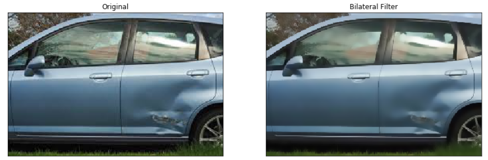

### KNN
The first attempt at classifying a car as damaged or whole uses K-nearest neighbors. Using a naive guess of k=5, my results were as follows:
  ```
  Accuracy when k=5 on unfiltered data is 60.99%
  Accuracy when k=5 on filtered data is 59.64%
  ```
  
This is not great. The default for Scikit learn's `KNeighborsClassifier` weight parameter is `weights = uniform`. This means that all points in each neighborhood are weighted equally. If `weights = distance`, then the points are weighted by the inverse of their distance. This means that closer neighbors will have a greater influence than more distant neighbors. After changing the weights parameter to `weights = distance`, my results were as follows:
  ```
  Accuracy when k=5 on unfiltered data is 61.66%
  Accuracy when k=5 on filtered data is 60.31%
  How much did accuracy change?
	  For unfiltered data: 0.6726%
	  For filtered data: 0.6726%
  The change is the same for both models: True
  ```
This is a little better, but still not much better than random guessing. Perhaps I need a different value for k?
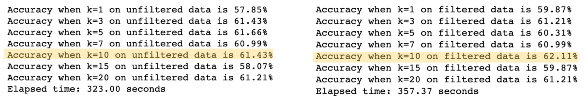

With a maxium accuracy of 62.11%, perhaps KNN is not the best choice for this task. Next, I will try Naive Bayes.


### Naive Bayes
A simple Bernolli Niave Bayes model yields the following results:
  ```
  Accuracy on unfiltered data is 61.66%
  Accuracy on filtered data is 49.78%
  ```
Here, the filtered data is doing worse than the unfiltered data. Laplace smoothing made this model even worse, which makes sense because it removes edges that may help detect car damage. Because of this low accuracy, I did not persue Naive Bayes further.

### Why the issues?
Why are KNN and Naive Bayes performing so poorly? One problem is the diversity of images in the dataset. 

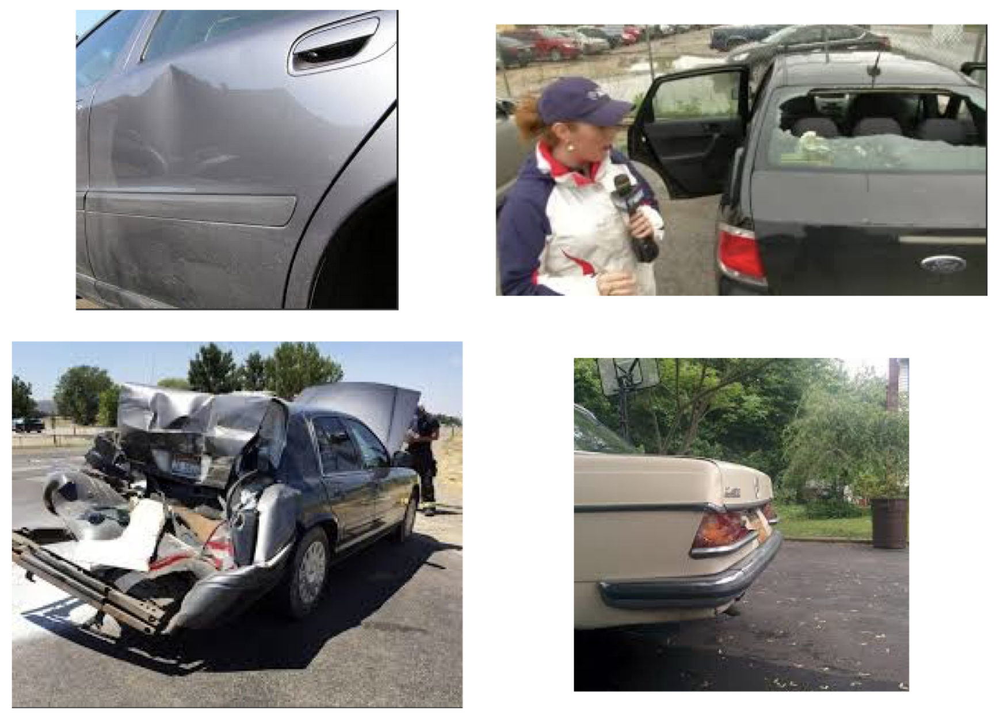

1. The images in the dataset are taken from different angles and distances.
2. Sometimes there are subjects other than cars in the images.
3. As a human, it can be difficult to tell where, or even if, a car is damaged.
4. Some of the cars are so badly damaged it is difficult to tell that it is even a car. 
5. The damage is in different areas; sometimes it is on the wheel, sometimes the body, the windshield, etc. 

I believe all of these issues are contributing to the inaccuracy of my models. 

# Next step: Neural Networks
When traditional machine learning fails, it is time to call in the big guns: neural networks. I started with a simple convolutional neural network to classify the images as damaged or whole. The initial network looks like this:

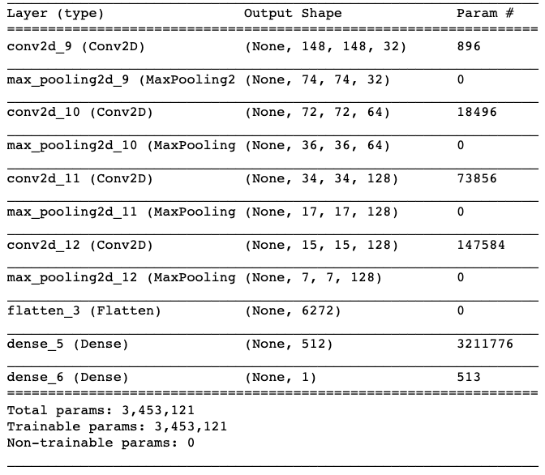

Below is a graph of accuracy and loss.

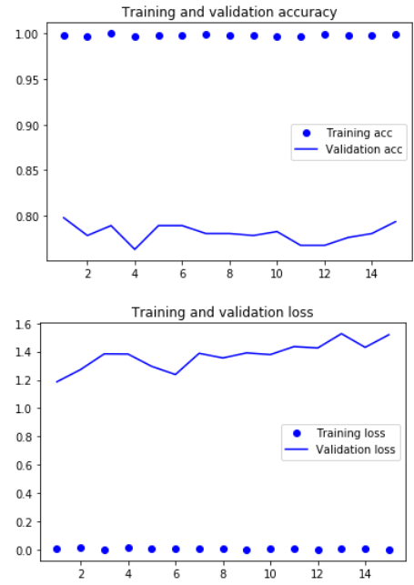

After training on 15 epochs, the training accuracy is 98.93% and the validation accuracy is 79.8%. This is quite a large improvement from the more traditional methods, but the high training and relatively low validation accuracy indicates that there is some overfitting. Can we do better?

#### Generating more data: Data Augmentation
It is well known that more data leads to better models. Sadly, I don't have access to more data in this case. Luckily, there is a way to generate more data for my model, and it is called data augmentation. Data augmentation generates more training data by augmenting the samples to create new beleivable looking images. These images are generated by random transformations. The idea is to "create" new data in order to reduce overfitting. However, this may or may not be enough to reduce overfitting because you cannot produce new information; only remix old information.

Here is an example of an augmented image from my dataset:

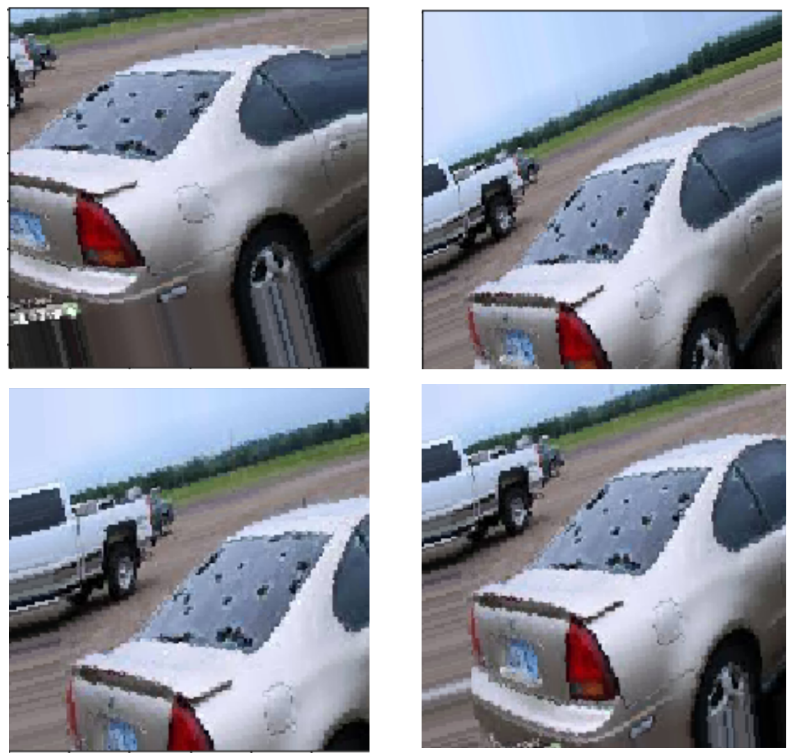

#### Dropout
Another way to reduce overfitting is to include dropout. Dropout is when some nodes of your neural network are randomly temporarily dropped.  This means that there is no information going in or coming out of that node while it is dropped. This forces the network to learn more robust features that are not too heavily dependent on any individual node. A drawback of dropout is that it takes approximately significantly more epochs to converge, but each epoch takes less time to train. The dropout model looks like this:

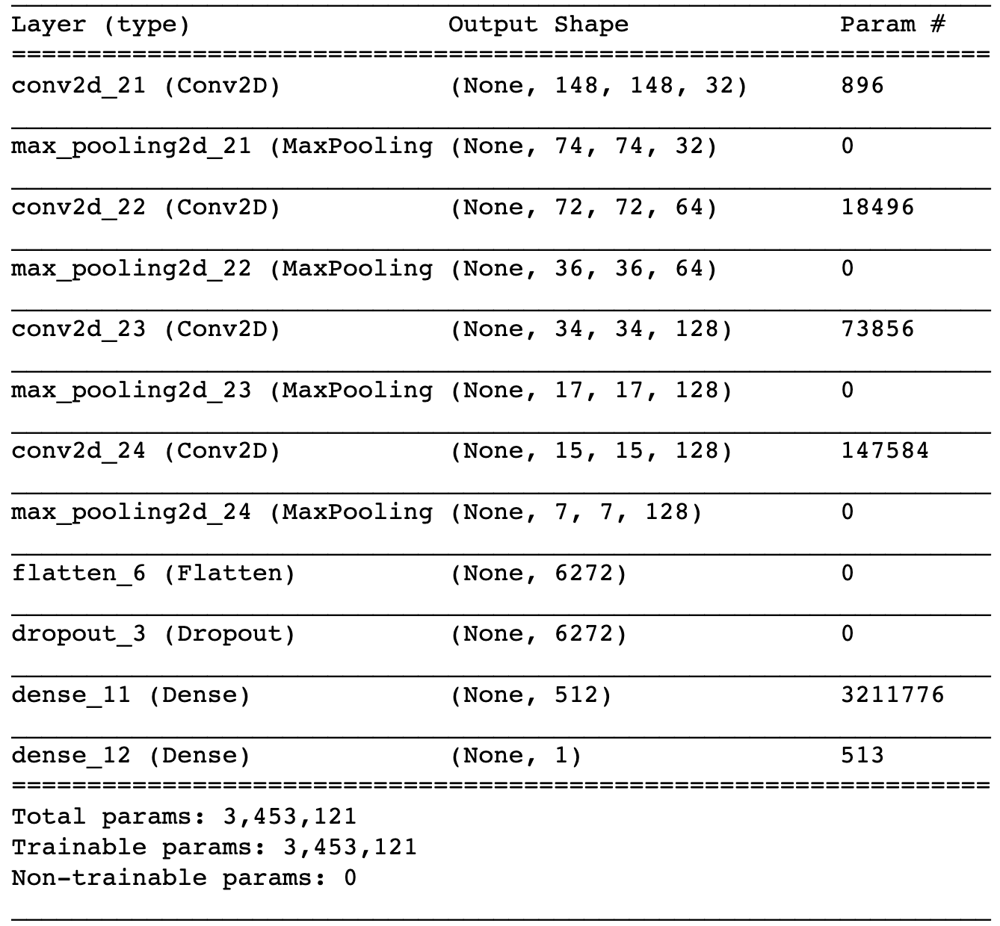

After training this dropout model with the augmented data for 30 epochs, the training accuracy is 75.6% and the validation accuracy is 82.2%. Below is a graph of accuracy and loss:

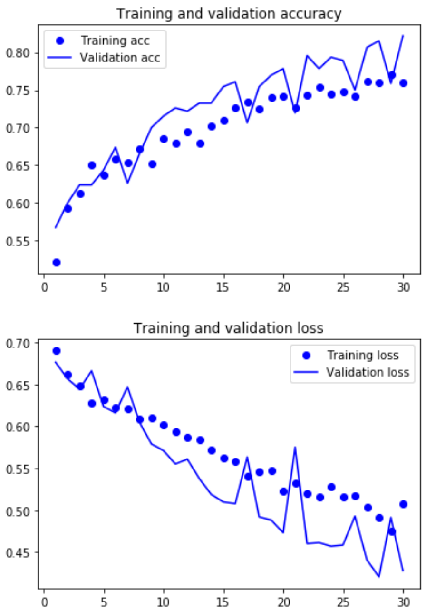

Because training and validation accuracy are both still increasing, and training and validation loss are still decreasing, I increased the number of epochs to 60. This resulted in a training accuracy of 80.7% and the validation accuracy of 83.9% Below is a graph of those results. 

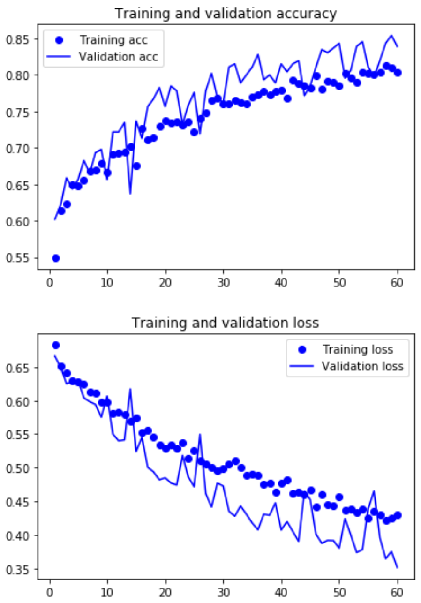

The training and validation still do not seem to have leveled off, so I trained one more model with 120 epochs. The final training accuracy is 85.9% and validation accuracy is 85.0%. The accuracy and loss still do not appear to have leveled off, but for this project I have decided that this level of accuracy is good enough. If more accuracy is needed, you can train on even more epochs until the validation loss starts to rise or the validation accuracy starts to decline. 

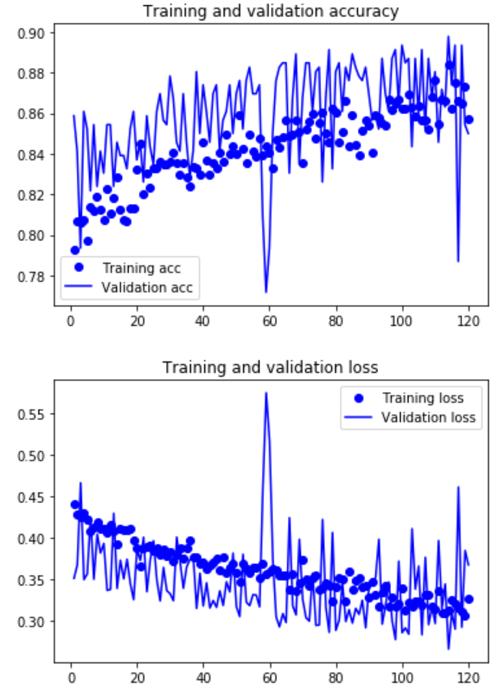

Below is a table summarizing the results of the two models. 
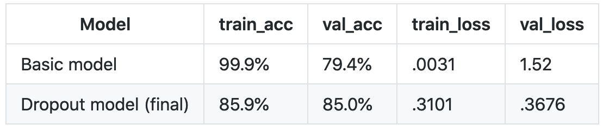

As you can see, the training accuracy is lower for the dropout model, but the validation accuracy is higher. This indicates that the dropout model with data augmentation has successfully reduced overfitting, and made the model more generalizable. The validation loss is lower for the dropout model as well, which is another indication that this model is better. 

# Conclusion

In an attempt to classify images of cars as damaged or whole, I have walked through the use of KNN, Naive Bayes, CNN, and CNN with dropout and data augmentation. In this case, the CNN with dropout and data aumentation performed the best. This is because neural networks in general are better at classifying images than more traditional methods, and the dropout/data augmentation prevents the CNN from overfitting. 

This concludes Part 1: Image classification. Please check out Part 2, where I will create a mask to overlay the damage on the cars. 
