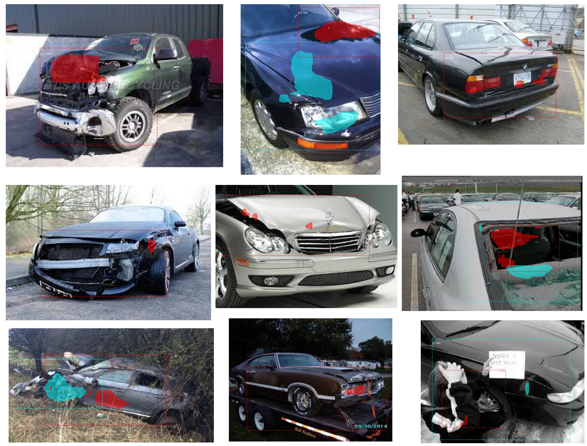

# Car Damage Detection: Part 2

##### By Patti Degner, Bethany Keller, and Chris Sexton

## Goal

The goal of this project is to to predict the location of damage to a car given an image of the damaged car. This information could be used for faster insurance assessment and claims processing.

Part 1 of this project seeks to classify images of cars as damaged or whole.

Part 2 applies masking to the images that outlines the damage on the car. 

## Data

Training and validation data was made available through Kaggle: https://www.kaggle.com/anujms/car-damage-detection#0001.JPEG

# Mask R-CNN

### What is Mask R-CNN?
A region-based convolutional neural network, or R-CNN, looks at an image and identifies objects that are in it. It uses a selective search algorithm (which extracts regions of images based on similarity of texture, color, etc.) to propose a region of interest, then uses a pretrained CNN to determine what object is in that region. If the region contains the object you are looking for, then the outline of that region is used a the bounding box for that object. 

Mask rCNN can not only determine where objects are, but it can also separate objects of the same type (instance segmentation). For example, if there is more than one car in an image, Mask-rCNN can tell. Then, a mask is applied to each object. The image below shows a bounding box around the damage on a car, as well as the mask that was applied to it. 

The Mask R-CNN that we used (https://github.com/matterport/Mask_RCNN) is built on top of COCO (Common Objects in COntext: https://cocodataset.org/#home); COCO is the pretrained CNN model underneath the R-CNN. 

### Annotations
In order to train the model to outline car damage, we need to feed it some examples. Tracing the outline of the object you are looking for is called annotating, and we annotated our training and validation images using this website: http://www.robots.ox.ac.uk/~vgg/software/via/via-1.0.6.html. This saved the outlines in a JSON file that could be read by the model. 

### Implementation
The implementation of this model is shown in this jupyter notebook: 

## Results
The model was validated on 259 images and has an accuracy of 91.8%. Below are a few examples of the output:

The model in general did a good job of caputring the damage inside the bounding box. There are very few examples where there is damage outside the bounding box. 

The model did not do as well with the damage masking. Overall, it generally did mask the damage, but not all of it (with the exception of the top-center image; it masked a shadow on the hood of a car). In the middle-left image, the model could tell that there was a broken window, but did not seem to know how to mask the damage. In the bottom-left image, a person is inside the bounding box. 

#### How could this model be improved?
  1. When annotating images, my team had slightly different methods. One person was drawing boxes around the images, while another was carefully outlining each curve of the damage. More consistent image annotation could lead to better accuracy. 
  2. The images are really low quality. When we was annotating images, sometimes it was hard to tell where the damage was because the image is so pixilated. This could lead to inaccurate annotations, as well as general confusion for the model. 
  3. There are images with subjects that are not cars. The example above shows one image with a person in it, but there are several images with this issue. If these images were removed, the accuracy could be improved. 
  4. It may or may not be helpful to further classify images before attempting masking. For example, perhaps we could first classify the images as window damage, body damage, or totaled, then train separate models for each of these. Further experimentation is needed to see if this would be helpful.

# Conclusion
In part 1 I classified images as damaged or whole using KNN, Naive Bayes, and CNN. In part 2 we created a Mask R-CNN model that can outline the damage on cars. Thank you for reading!
