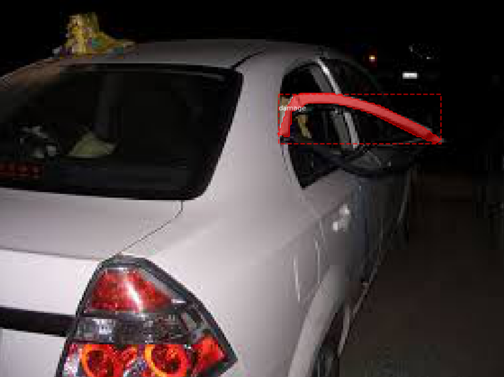

# Car Damage Detection: Part 2

*This document is a work in progress*

##### By Patti Degner, Bethany Keller, and Chris Sexton

## Goal

The goal of this project is to to predict the location of damage to a car given an image of the damaged car. This information could be used for faster insurance assessment and claims processing.

Part 1 of this project seeks to classify images of cars as damaged or whole.

Part 2 applies masking to the images that outlines the damage on the car. 

## Data

Training and validation data was made available through Kaggle: https://www.kaggle.com/anujms/car-damage-detection#0001.JPEG

# Mask R-CNN

### What is Mask R-CNN?
A region-based convolutional neural network, or R-CNN, looks at an image and identifies objects that are in it. It uses a selective search algorithm (which extracts regions of images based on similarity of texture, color, etc.) to propose a region of interest, then uses a pretrained CNN to determine what object is in that region. If the region contains the object you are looking for, then the outline of that region is used a the bounding box for that object. 

Mask rCNN can not only determine where objects are, but it can also separate objects of the same type (instance segmentation). For example, if there is more than one car in an image, Mask-rCNN can tell. Then, a mask is applied to each object. The image below shows a bounding box around the damage on a car, as well as the mask that was applied to it. 

The Mask R-CNN that I used (https://github.com/matterport/Mask_RCNN) is built on top of COCO (Common Objects in COntext: https://cocodataset.org/#home); COCO is the pretrained CNN model underneath the R-CNN. 

### Annotations
In order to train the model to outline car damage, we need to feed it some examples. Tracing the outline of the object you are looking for is called annotating, and we annotated our training and validation images using this website: http://www.robots.ox.ac.uk/~vgg/software/via/via-1.0.6.html. This saved the outlines in a JSON file that could be read by the model. 

### Implementation
I walk through the implementation of this model in this jupyter notebook: LINKLINKLINKLINKLINKLINK
If you are looking at this website before I have added a link, it is because I had my .h5 file with the model weights on my old computer, not backed up anywhere, and that computer died. So, I had to retrain the whole thing and it is currently still training. 

# Conclusion
In part 1 I classified images as damaged or whole using KNN, Naive Bayes, and CNN. In part 2 I created a Mask R-CNN model that can outline the damage on cars. Thank you for reading!
